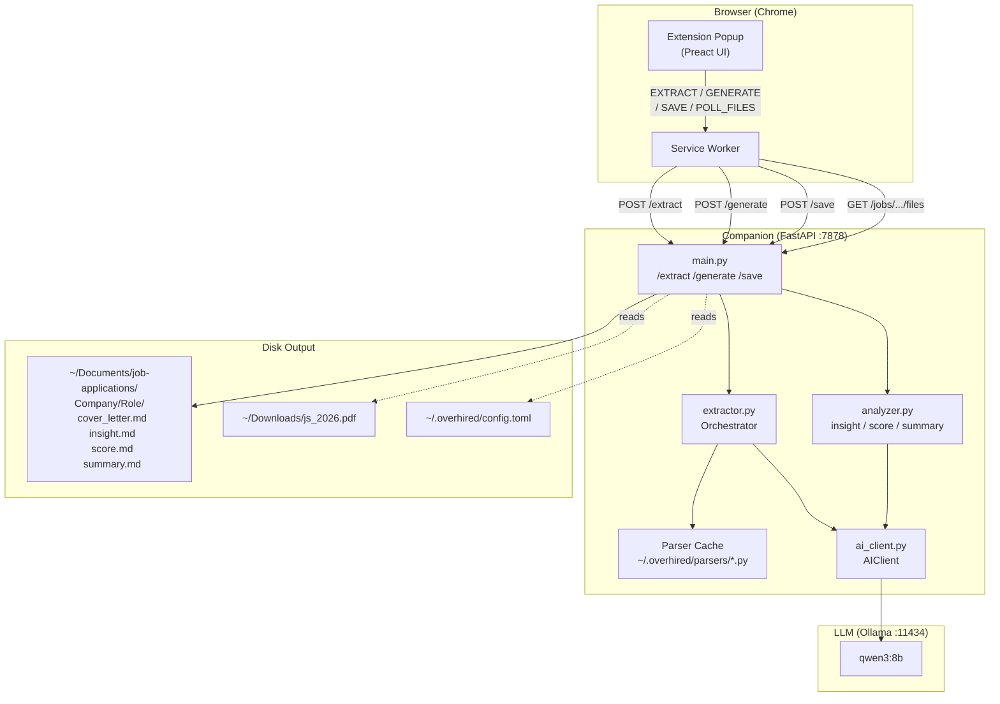
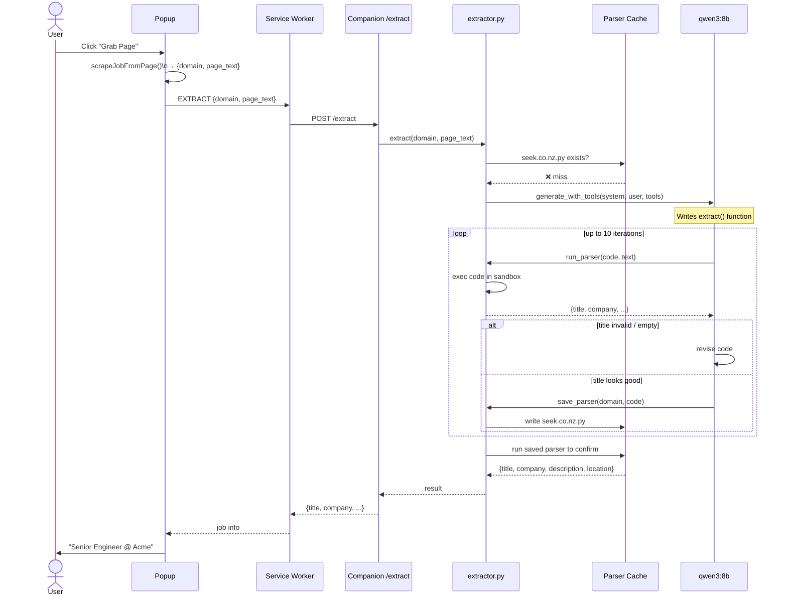
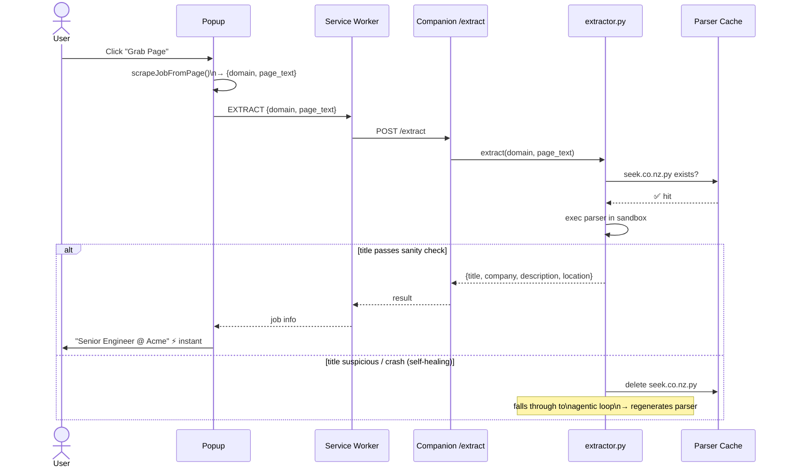

# overhired

> The luxury problem of too many offers.

**overhired** is a browser extension + local companion service that reads any job posting, generates a personalized cover letter using your local AI, and produces a full analysis package — cover letter, job fit score, company summary, and jargon decoder — saved to disk automatically.

---

## Features

- **One-click grab** — scrapes any job page and extracts title, company, description via LLM
- **Adaptive parsers** — companion writes and caches a Python parser per site; instant on repeat visits
- **Self-healing** — stale or broken parsers are auto-detected and regenerated
- **AI cover letter** — personalized to your resume and the specific role
- **Post-save analysis** — `insight.md` (jargon decoder), `score.md` (fit score), `summary.md` (company profile)
- **Local-first AI** — defaults to [Ollama](https://ollama.com); OpenAI and Claude supported
- **Privacy by design** — resume stays on disk; only job text reaches the AI
- **Feng shui panel** — daily lucky day + best interview dates 🈴

---

## Quick Start

### 1 — Configure `~/.overhired/config.toml`

```toml
output_dir     = "~/Documents/job-applications"
companion_port = 7878
auth_token     = ""

[ai]
provider = "ollama"
endpoint = "http://localhost:11434"
model    = "qwen3:8b"
timeout      = 180
tool_timeout = 600

[resume]
path = "~/Documents/my-resume.pdf"   # PDF, MD or TXT
```

### 2 — Start companion

```bash
cd overhired/companion
pip install -r requirements.txt
python main.py
# optional flags:
#   --port 7878
#   --log-level debug
#   --reload          (dev mode, auto-restart on changes)
```

### 3 — Load the extension

1. Open `chrome://extensions`
2. Enable **Developer mode**
3. Click **Load unpacked** → select the `extension/` folder
4. Pin the overhired icon to your toolbar

---

## How It Works

1. Navigate to any job posting
2. Click the overhired icon → **Grab Page**
3. Companion extracts job info (instant if site seen before, ~30s first time)
4. Click **Generate Cover Letter** — companion reads your resume from disk and calls the AI
5. Cover letter is saved; analysis files are written in the background

---

## Architecture



---

## Sequence: First visit (no parser)



---

## Sequence: Repeat visit (parser cached)



---

## AI Providers

| Provider | Config | Notes |
|----------|--------|-------|
| **Ollama** (default) | `endpoint: http://localhost:11434` | Free, private, local |
| **llama.cpp** | `endpoint: http://localhost:8080` | OpenAI-compatible API |
| **OpenAI** | `provider: openai` + `api_key` | GPT-4o recommended |
| **Anthropic** | `provider: claude` + `api_key` | claude-3-5-sonnet recommended |

---

## Output Files

After each application, the companion writes to `~/Documents/job-applications/<Company>/<Role>/`:

| File | Contents |
|------|----------|
| `cover_letter.md` | Generated cover letter (Markdown) |
| `cover_letter.html` | Same, rendered as HTML |
| `insight.md` | Jargon decoder — red flags, culture signals |
| `score.md` | Job fit score against your resume |
| `summary.md` | Company profile fetched from their website |

---

## Requirements

- Python 3.10+
- Chrome 109+
- Ollama (recommended) or an OpenAI/Claude API key

---

## License

MIT — see [LICENSE](LICENSE)

