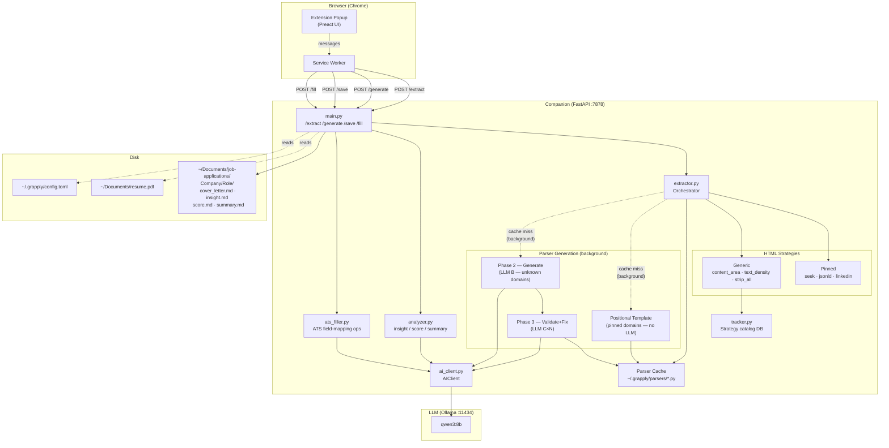
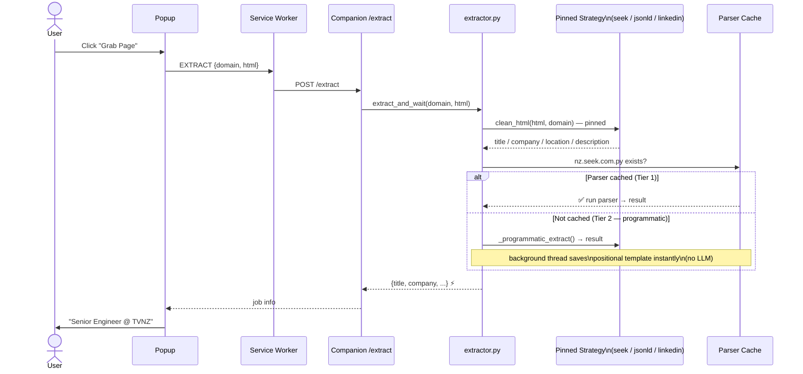
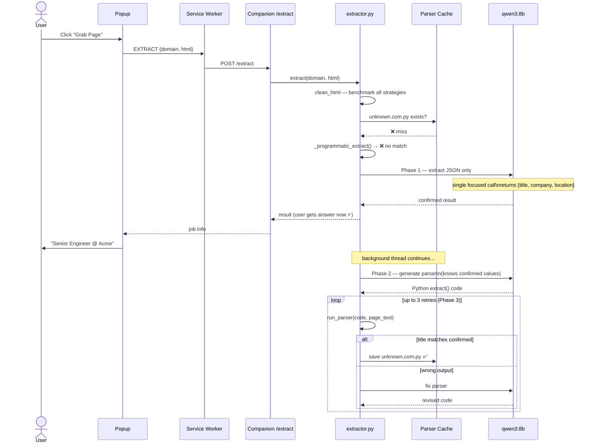
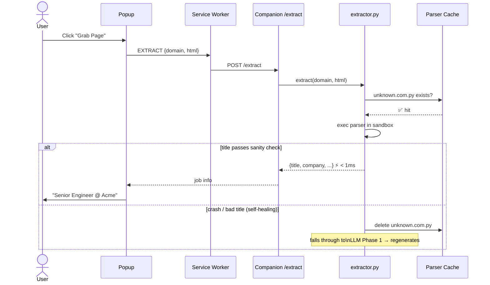

# grapply

> The luxury problem of too many offers.

**grapply** is a browser extension + local companion service that reads any job posting, generates a personalized cover letter using your local AI, and produces a full analysis package — cover letter, job fit score, company summary, and jargon decoder — saved to disk automatically.

---

## Features

- **One-click grab** — scrapes any job page; extraction is instant for known sites (SEEK, Indeed, LinkedIn) via structured programmatic strategies, zero LLM
- **Quality-first parsers** — 3-phase pipeline: extract → generate → validate+fix; parsers are cached and re-used; <1ms on repeat visits
- **Pinned strategies** — SEEK, Indeed and LinkedIn always use their native structured data (inline JSON / JSON-LD / title tag), not fragile CSS selectors
- **Self-healing** — stale or broken parsers are auto-detected and regenerated
- **AI cover letter** — personalized to your resume and the specific role
- **Post-save analysis** — `insight.md` (jargon decoder), `score.md` (fit score), `summary.md` (company profile)
- **ATS form filler** — detects application forms, generates field-mapping ops once per site, then fills instantly
- **Local-first AI** — defaults to [Ollama](https://ollama.com); OpenAI and Claude supported
- **Privacy by design** — resume stays on disk; only job text reaches the AI
- **Feng shui panel** — daily lucky day + best interview dates 🈴

---

## Quick Start

### 1 — Configure `~/.grapply/config.toml`

```toml
output_dir     = "~/Documents/job-applications"
companion_port = 7878
auth_token     = ""

[ai]
provider = "ollama"
endpoint = "http://localhost:11434"
model    = "qwen3:8b"
timeout      = 180
tool_timeout = 600

[resume]
path = "~/Documents/my-resume.pdf"   # PDF, MD or TXT
```

### 2 — Start companion

```bash
cd grapply/companion
pip install -r requirements.txt
./start.sh          # kills nothing if already running; starts fresh otherwise
# or manually:
#   python -m uvicorn main:app --host 127.0.0.1 --port 7878
```

### 3 — Load the extension

1. Open `chrome://extensions`
2. Enable **Developer mode**
3. Click **Load unpacked** → select the `extension/` folder
4. Pin the grapply icon to your toolbar

---

## How It Works

1. Navigate to any job posting
2. Click the grapply icon → **Grab Page**
3. Companion extracts job info (instant for SEEK / Indeed / LinkedIn; ~3–10 min LLM call on first visit to an unknown site)
4. Click **Generate Cover Letter** — companion reads your resume from disk and calls the AI
5. Cover letter is saved; analysis files are written in the background

---

## Extraction Strategy

Extraction is tiered — LLM is only used when nothing else works:

| Tier | Trigger | Speed | LLM? |
|------|---------|-------|------|
| **1 — Cached parser** | Parser file exists for domain | < 1 ms | ❌ |
| **2 — Programmatic** | SEEK / Indeed / LinkedIn (pinned domains) | < 5 ms | ❌ |
| **3 — LLM Phase 1** | Unknown domain, first visit | ~3–10 min | ✅ once |

After Tier 2 or 3, a parser is saved in the background so the **next visit is always Tier 1**.

---

## Parser Generation (Background, Quality-First)

For **pinned domains** (SEEK, Indeed, LinkedIn), `clean_html` always uses the site's native structured extractor, producing a stable 4-line format (`title / company / location / description`). A deterministic positional template is saved immediately — no LLM needed.

For **unknown domains**, the 3-phase pipeline runs in the background after extraction returns to the user:

```
Phase 1 — Extract (LLM A)   focused JSON-only call → confirmed {title, company, location}
Phase 2 — Generate (LLM B)  writes Python parser using confirmed values as ground truth
Phase 3 — Validate+Fix      runs parser → compares → asks LLM to fix (up to 3 retries)
```

---

## Self-Healing Parsers

The parser cache validates every result before trusting it:

| Situation | What happens |
|-----------|-------------|
| Parser raises an exception | Logged ⚠️, deleted, pipeline regenerates |
| Parser returns empty title | Logged ⚠️, deleted, pipeline regenerates |
| Title too short (< 5 chars) | Logged ⚠️, deleted, pipeline regenerates |
| Title matches domain name (`"SEEK"`, `"LinkedIn"`) | Logged ⚠️, deleted, pipeline regenerates |
| Title too long or contains newlines | Logged ⚠️, deleted, pipeline regenerates |
| Title looks legitimate | ✅ `[cache] hit — title='Senior Engineer'` |

---

## Architecture



---

## Sequence: Pinned domain (SEEK / Indeed / LinkedIn)



---

## Sequence: Unknown domain — first visit



---

## Sequence: Repeat visit (parser cached)



---

## LLM Usage Summary

| Task | LLM calls | Frequency |
|------|-----------|-----------|
| Extraction — pinned domain (SEEK/Indeed/LinkedIn) | 0 | Never |
| Extraction — unknown domain, first visit | 1 (Phase 1) | Once per domain |
| Parser generation — pinned domain | 0 | Never |
| Parser generation — unknown domain | 2–5 (Phase 2 + Phase 3 retries) | Once per domain |
| Cover letter | 1 | Every application |
| Analysis (insight / score / summary) | 3 | Every application |
| ATS filler generation | 1–3 | Once per ATS domain |
| ATS filler use (cached) | 0 | Every subsequent fill |

---

## AI Providers

| Provider | Config | Notes |
|----------|--------|-------|
| **Ollama** (default) | `endpoint: http://localhost:11434` | Free, private, local |
| **llama.cpp** | `endpoint: http://localhost:8080` | OpenAI-compatible API |
| **OpenAI** | `provider: openai` + `api_key` | GPT-4o recommended |
| **Anthropic** | `provider: claude` + `api_key` | claude-3-5-sonnet recommended |

---

## Output Files

After each application, the companion writes to `~/Documents/job-applications/<Company>/<Role>/`:

| File | Contents |
|------|----------|
| `cover_letter.md` | Generated cover letter (Markdown) |
| `cover_letter.html` | Same, rendered as HTML |
| `insight.md` | Jargon decoder — red flags, culture signals |
| `score.md` | Job fit score against your resume |
| `summary.md` | Company profile fetched from their website |


Example of insight.md:

```md
# Role Insights — Software Engineer at XXX

**Verdict:** Apply with caution ⚠️  **Generated:** 2026-05-15

> A high-pressure, ambitious role in a edtech startup with lofty goals but potential instability

## 🚩 Red Flags

| Phrase | What it really means |
|--------|---------------------|
| It’s a difficult problem that requires brilliant people and tremendous effort over time | This is a classic corporate euphemism for 'we’re struggling and need you to fix it'—a red flag for unstable product/market fit or internal challenges |
| operating with significant autonomy in a dynamic development environment | Autonomy sounds great, but 'dynamic' often means chaotic or unstructured, which can lead to burnout or unclear priorities |

## ✅ Green Flags

| Phrase | What it signals |
|--------|----------------|
| cross-disciplinary leadership | Collaboration across teams is a good sign of a mature organization, but only if it's not just lip service |

---
*Generated by grapply*
```

Example of score.md:
```md
# Job Fit — Software Engineer at XXX

## Score: 7/10 — Apply with caveats ⚠️

**Experience gap:** minor  **Overqualified risk:** No  **Generated:** 2026-05-15

## ✅ Matching Skills
- cross-platform build systems
- CI/CD pipeline development
- cloud integration
- test-driven development
- system performance optimization

## ❌ Missing Skills
- C/C++/C# expertise
- real-time system architecture
- game-specific systems design
- educational game development experience

## Honest Assessment
Your extensive experience with system architecture, CI/CD pipelines, and performance optimization directly aligns with the technical leadership requirements. The cloud integration and cross-platform build system expertise are particularly relevant to XXX's technology stack. While the C/C++/C# gap is notable, your C# experience with AWS and strong systems design background position you well for growth. Consider focusing on transferable skills in real-time systems and collaborative development practices to bridge the gap.

---
*Generated by grapply*
```

---

## Requirements

- Python 3.10+
- Chrome 109+
- Ollama (recommended) or an OpenAI/Claude API key

---

## License

MIT — see [LICENSE](LICENSE)


